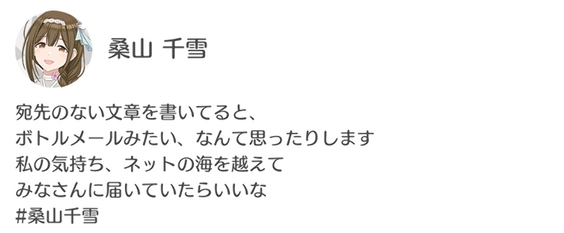

(あかんのか？)

# はじめに

spotifyやyoutubeで「2025年を振り返りませんか？」という文言を見かける時期になりました。

<iframe data-testid="embed-iframe" style="border-radius:12px" src="https://open.spotify.com/embed/playlist/37i9dQZEVXdi2l2PJ3ycsc?utm_source=generator&theme=0" width="100%" height="352" frameBorder="0" allowfullscreen="" allow="autoplay; clipboard-write; encrypted-media; fullscreen; picture-in-picture" loading="lazy"></iframe>

せっかくなのでこのブログでもさっくり2025年を振り返りつつ
印象に残った出来事を中心に書き残していきます。

2025年という字面の未来感が凄いです。

---

# 人生

俺は2025年何してたっけとなっています。手がかりがどこにも残っていないためです。

Twitterで`from:sifi_border since:2025-01-01`で検索してみます。情報量が薄い。終わりです。

こうならないためにこのブログを始めたんでした。来年以降はブログ記事を見返すだけで済むようにしたいです。

## 結婚

流石に覚えている出来事として、友人の結婚式に参加してきました。

大学時代の友人のが一回と、高校時代の友人のが一回の計二回です。

自分はマメに連絡を取るような親密な人間はいないですが、インスタやfacebookを定期的に巡回して知人の動向を把握しているつもりになってます。

そういったSNSで結婚や出産(！)などのビッグイベントは耳に入れており、招待が来てもこの前のアレか〜という感じではありました。

ただ実際に式に参加すると人生を進めてるな〜という感じが漂っており泣けます。めでたい気持ちと自分の停滞感の両方ですね。

どちらの式も自分にちょっとした出番があり（スピーチみたいな大役ではないですが）、参加してる感があり良かったです。

特に高校の友人の方は中学一年生の頃から寮生活を共にしてきたので、込み上げるものがありました。

幸せになってほしいです。(幸せって何？という疑問は残りますが...)

## 投資

NISAってよく聞くけど何なんすかね？という状態でしたが、claudeにresearchしてもらいつつ口座を開設して積み立て始めました。

よくわかってないけどいい感じに増えてほしいです以外の感情がない。投資家の方々よろしくお願いします。

---

# 仕事

3年目ということもありデカめのタスクを任される機会が多かったように感じる。

チームの管理っぽいことも経験し、チーム外の人間とのやり取りをする機会が増え時間やメンタルを消耗していた。

技術領域としては主にAndroidアプリ周りをやっており、新機能を一人でいい感じに追加していた...
というのは嘘で、結局後半はシニアエンジニアに泣きついて分担していた。

知識不足で実装が遅れるだけならまだしも、設計が固まらないうちにカスのPR[^1]を作ってしまうなど反省が多かった。

抽象度の高いタスクをいい感じに捌けるといいんだろうけど難しいです。

期待に応えられたかというと微妙だったと思います。

[^1]: diffが大きく内容が不明瞭でreviewerの時間をいたずらに奪うだけのPR。当然mergeできない。

---

# 趣味

## イベント

密に連絡を取る友人はいないと書いたが、
麻倉ももさんのオタクに誘われてTrySail 10周年のライブと上野でのオーケストラコンサートに参加した。

後者は大人の嗜みって感じのイベントで特に良かった。

<blockquote class="twitter-tweet" data-theme="dark" data-dnt="true" align="center">
文化人 <a href="https://t.co/gAhdW5xMzb">pic.twitter.com/gAhdW5xMzb</a>
&mdash; いいてんき！🌗 今日もがんばりぼんだ！ (@sifi_border) <a href="https://twitter.com/sifi_border/status/1949008910708514936?ref_src=twsrc%5Etfw">July 26, 2025</a></blockquote>

このようにイベントに誘ってくれる友人には本当に感謝している。

## ゲーム

今年は主にSF6をやっていた。

一応進捗としては舞、豪鬼、ジュリでmasterに到達した。最近はジュリの研究をしている。

来年も同じくらい打ち込めそうならhigh masterを目指したい。

Shadowverseの新作もちょくちょくやっていた。

リリース直後にmasterまでやったが、最近はあまり時間を割いていない。
一生やれてしまう自信があるのであえて絶っている側面もあります。

ゲーム自体は非常に面白いと思っていて、好きなデッキの記事とか書きたさはあります。

## 輪読

会社の同期と隔週くらいのペースで雪江代数を読み進めている。

輪読といっても特に事前準備はせず、行き当たりばったりでダラダラ読み進める感じです。

動機としては [cryptohack](https://cryptohack.org/)
で消化しきれなかった暗号理論の理解の一助になればという感じだが、道のりはだいぶ長そう。

## シャニソン

シャニマスのオタクにアイキューの動画を見せられてすっかりハマってしまった。

<iframe width="100%" height="468" src="https://www.youtube.com/embed/YTEfWavFIvI?si=N1WTorLKL0uwLsU_" title="YouTube video player" frameborder="0" allow="accelerometer; autoplay; clipboard-write; encrypted-media; gyroscope; picture-in-picture; web-share" allowfullscreen></iframe>

5年ほど前にシャニマスは少し齧ってたが、だいぶ離れてたので知らないユニットが2つも増えてて驚いた。

シャニソンのストーリーをちまちま見てるが、気になるキャラについては原作(？)の方もやっていかないとな...と思っている。

---

# おわりに

SF6に現を抜かして年内ギリギリになってしまいました。

最近の記憶に引っ張られて偏った&雑然とした内容になっていると思います。

2026年の目標みたいなものは現時点ではないですが、ちょくちょく記事を書いていければとは思ってます。

ハッシュタグ桑山千雪、良すぎる。

では良いお年を。
